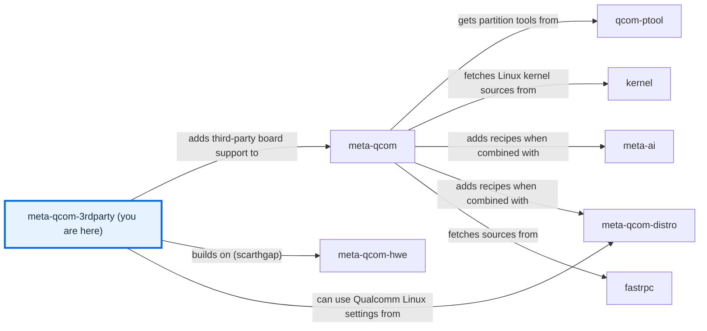

# meta-qcom-3rdparty

[)](https://github.com/qualcomm-linux/meta-qcom-3rdparty/actions/workflows/push.yml)
[)](https://github.com/qualcomm-linux/meta-qcom-3rdparty/actions/workflows/nightly-build.yml)

[)](https://github.com/qualcomm-linux/meta-qcom-3rdparty/actions/workflows/push.yml?query=branch%3Awrynose)
[)](https://github.com/qualcomm-linux/meta-qcom-3rdparty/actions/workflows/nightly-build.yml?query=branch%3Awrynose)

## Introduction

OpenEmbedded/Yocto Project BSP layer for Third-Party Maintained Qualcomm based
platforms.

This layer provides additional recipes and machine configuration files for
Third-Party Maintained Qualcomm platforms. Reference boards that are officially
supported by Qualcomm are available via [`meta-qcom`](https://github.com/qualcomm-linux/meta-qcom) instead.

To build a first image for a supported board, follow the
[usage tutorial](docs/source/user/USAGE.md).

This layer depends on:

```text
URI: https://github.com/openembedded/openembedded-core.git
layers: meta
branch: master
revision: HEAD

URI: https://github.com/qualcomm-linux/meta-qcom.git
branch: master
revision: HEAD
```

## Branches

| Branch | Purpose | Status | Build from it | Contributions |
| --- | --- | --- | --- | --- |
| `main` | Primary development branch, with focus on upstream support and compatibility with the most recent Yocto Project release. | Active development, compatible with Yocto Project 6.1 (blacksail). | Yes, for `rubikpi3` and `radxa-dragon-q6a`. | Yes; see the [contribution guidelines](docs/source/contributing/CONTRIBUTING.md). |
| `wrynose` | LTS branch based on the Yocto Project 6.0 release, used by Qualcomm Linux 2.x. | Maintained release branch; the Yocto Project supports 6.0 until April 2030 ([releases](https://wiki.yoctoproject.org/wiki/Releases)). | Yes, for `rubikpi3` and `radxa-dragon-q6a`. | Backports of `main` changes, and changes that apply only to `wrynose`; see the [contribution guidelines](docs/source/contributing/CONTRIBUTING.md). |
| `scarthgap` | Qualcomm Linux >= 1.4, aligned with Yocto Project 5.0 (LTS). | Not documented; the Yocto Project supports 5.0 until April 2028 ([releases](https://wiki.yoctoproject.org/wiki/Releases)); last commit 2025-09-03 ([history](https://github.com/qualcomm-linux/meta-qcom-3rdparty/commits/scarthgap)). | No: it holds only the layer configuration and policy files, with no machines or recipes. | Qualcomm Linux 1.x contributions; see the [contribution guidelines](docs/source/contributing/CONTRIBUTING.md). |
| `kirkstone` | Qualcomm Linux <= 1.3, aligned with Yocto Project 4.0 (LTS). | Not documented; the Yocto Project lists 4.0 as end of life ([releases](https://wiki.yoctoproject.org/wiki/Releases)); last commit 2025-04-09 ([history](https://github.com/qualcomm-linux/meta-qcom-3rdparty/commits/kirkstone)). | No: it holds only the layer configuration and policy files, with no machines or recipes. | Not documented. [SECURITY.md](SECURITY.md) accepts patches only for current LTS releases and `main`. |
| `next` | Not documented. | Not documented; last commit 2026-08-20 ([history](https://github.com/qualcomm-linux/meta-qcom-3rdparty/commits/next)). | Not documented. Its tree has machine configurations for `radxa-dragon-q6a`, `uno-q`, and `ventuno-q`. | Not documented. |

[BRANCHES.md](BRANCHES.md) describes how each branch is maintained and how it
relates to `main`.

## Machine Support

See [conf/machine](conf/machine/README.md) for the complete list of supported devices.

## Documentation

Build the site locally with `make -f docs/source/Makefile setup html` from the
repository root, then open `docs/site/index.html` directly in a browser. The
[documentation guide](docs/README.md) explains where its source lives.

- [Usage tutorial](docs/source/user/USAGE.md) — Build an image for a supported board.
- [Configuration reference](docs/source/user/CONFIGURATION.md) — Look up the layer, machine, kas, and CI settings.
- [Development setup](docs/source/contributing/DEVELOPMENT.md) — Install the documentation tools, and build and check the site.
- [Function reference](docs/source/contributing/README.md#function-reference) — Read the reference generated from the function comments in the sources.
- [Agent guide](docs/source/contributing/AGENTS.md) — Build and check the layer as CI does.

## Contributing

Please read [docs/source/contributing/CONTRIBUTING.md](docs/source/contributing/CONTRIBUTING.md)
for the contribution workflow, the layer scope rules and the commit subject and
message requirements before opening a pull request.

## Communication

- **GitHub Issues:** [meta-qcom-3rdparty issues](https://github.com/qualcomm-linux/meta-qcom-3rdparty/issues)
- **Pull Requests:** [meta-qcom-3rdparty pull requests](https://github.com/qualcomm-linux/meta-qcom-3rdparty/pulls)

## Maintainer(s)

- Ricardo Salveti <ricardo.salveti@oss.qualcomm.com>
- Nicolas Dechesne <nicolas.dechesne@oss.qualcomm.com>

## License

This layer is licensed under the MIT license. Check out [LICENSE](LICENSE)
for more details. [NOTICE](NOTICE) holds the notices for the documentation tools
adapted from other projects.

## Folders

- [.github/](.github/) — Holds [CODEOWNERS](.github/CODEOWNERS), the CI [workflows](.github/workflows/), the [issue templates](.github/ISSUE_TEMPLATE/) and [pull request template](.github/PULL_REQUEST_TEMPLATE/pr_template.md), the Markdown lint rules, and the documentation build helpers.
- [ci/](ci/README.md) — Holds the kas configuration and the scripts CI runs.
- [conf/](conf/README.md) — Holds the layer and machine configuration.
- [docs/](docs/README.md) — Holds the documentation source and explains how to build the site.
- [dynamic-layers/](dynamic-layers/README.md) — Holds metadata that applies only when another layer is in the build.
- [recipes-bsp/](recipes-bsp/README.md) — Holds the board firmware recipes and packagegroups.
- [recipes-kernel/](recipes-kernel/README.md) — Holds the board-specific kernel appends and configuration.

## Files

- [README.md](README.md) — Introduces the layer, its branches, and its contents.
- [BRANCHES.md](BRANCHES.md) — Describes how each branch is maintained.
- [CONTRIBUTING.md](CONTRIBUTING.md) — Points to the contribution guidelines.
- [AGENTS.md](AGENTS.md) — Points automation agents to the agent guide.
- [CLAUDE.md](CLAUDE.md) — Links to AGENTS.md for agents that read this file name.
- [CODE_OF_CONDUCT.md](CODE_OF_CONDUCT.md) — States participation standards and how to report conduct concerns.
- [SECURITY.md](SECURITY.md) — Gives the private route for reporting vulnerabilities.
- [LICENSE](LICENSE) — Contains the layer's MIT licence.
- [NOTICE](NOTICE) — Keeps the licence notices of adapted documentation tools.
- [.env.example](.env.example) — Documents the environment settings for local kas-container builds.
- [.gitignore](.gitignore) — Keeps local settings, the documentation environment, and generated output out of Git.

<!-- repository-map:start -->

## Repository map



[Full Qualcomm repository map](https://github.com/devdocsorg/qualcomm-repository-map).

<!-- Generated from https://github.com/devdocsorg/qualcomm-repository-map at ea769a8df1c7cdc9abdecdbc142ef0731023c748; dataset SHA-256: 89d115013900f5bb4764c76f3bebe5210532d8167c721fbc280043351dda086a. -->

<!-- repository-map:end -->
